# FlexiFaaS – Serverless Function Deployment Engine

FlexiFaaS is a secure, scalable, and modular Function-as-a-Service (FaaS) platform that allows users to upload, execute, and manage functions in multiple programming languages (Java, Python, JavaScript) without managing backend infrastructure.

The project is built as part of **M.Tech Final Year Dissertation** at **BITS Pilani**.

---

## Features

- Multi-language function execution (Java, Python, JavaScript)
- Asynchronous, event-driven execution using RabbitMQ
- JWT-based authentication & role-based authorization
- AES-based file encryption & malware scanning
- Interactive ReactJS-based frontend
- Modular architecture with independent backend, middleware, and frontend services

---

## Architecture


- **Frontend** → ReactJS client
- **Middleware** → Authentication, authorization, encryption, malware scan
- **Backend** → Spring Boot APIs + Function Execution Engine
- **RabbitMQ** → Message broker for async execution
- **MySQL** → Persistent storage of metadata & logs

---

## Component level Architecuture

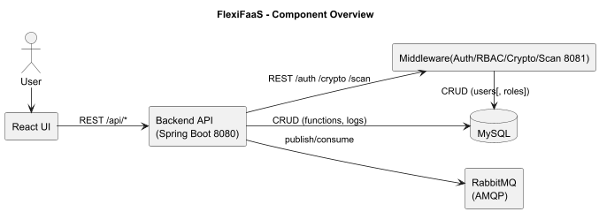

---

## Workflow


1. User registers & logs in
2. User Authentication from Middleware service
3. Authenticated and Authorized
4. Uploads a function (file/code)
5. Backend service calls Middleware service for malware scan and encryption
6. Middleware validates & secures the request
7. Store function metadata and code in database
8. Function is queued in RabbitMQ
9. Worker executes function in requested runtime
10. Logs & results are stored in database
11. User views results via frontend

---

## Deployment Diagram

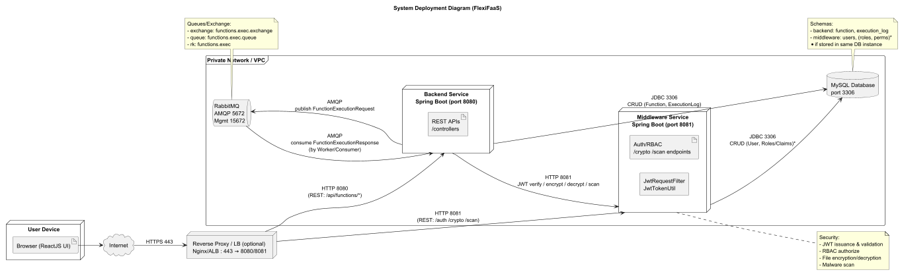

---

## 📸 Screenshots

- Splash Screen

  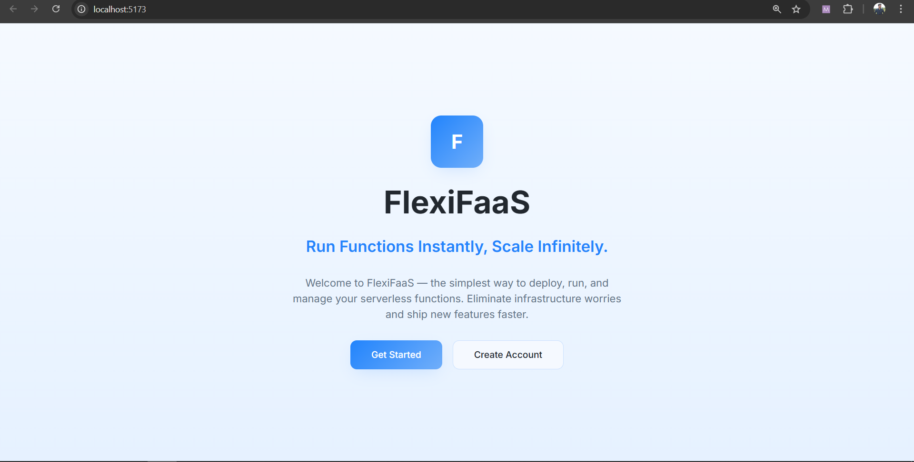

- Registration
  
- Login
  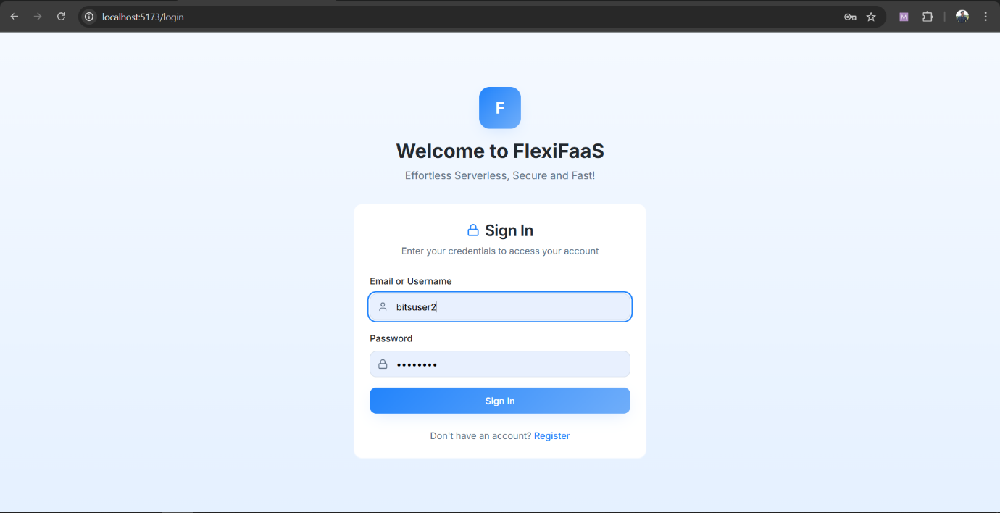
- Dashboard
  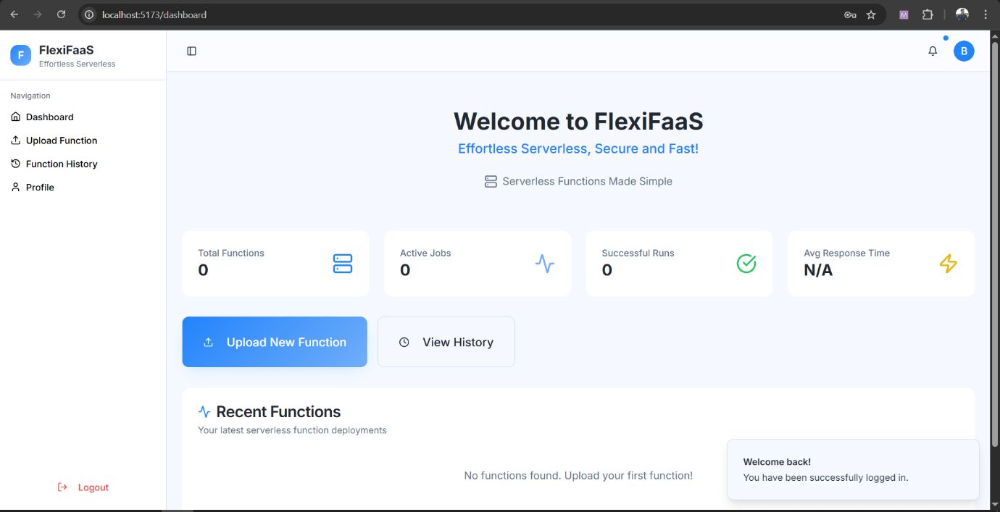

- User Profile
  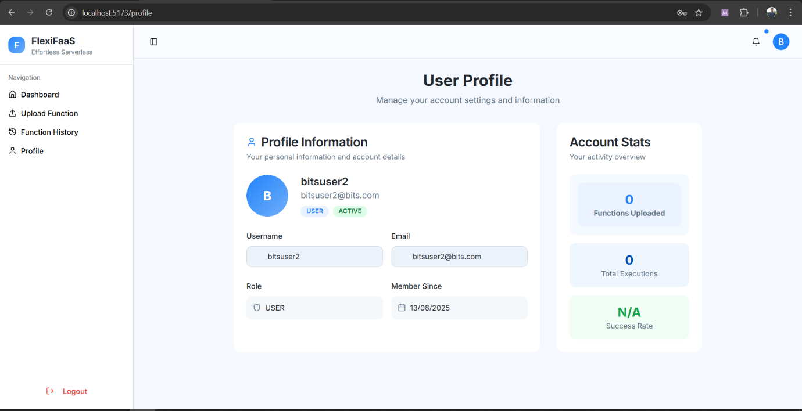

- Function Upload Page
  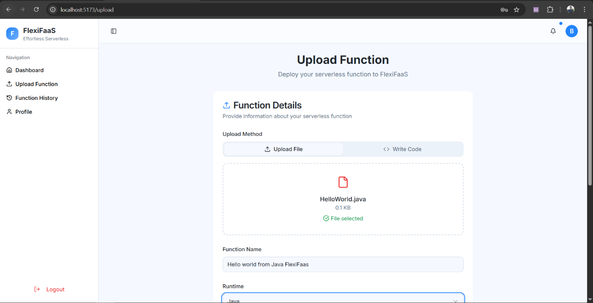
  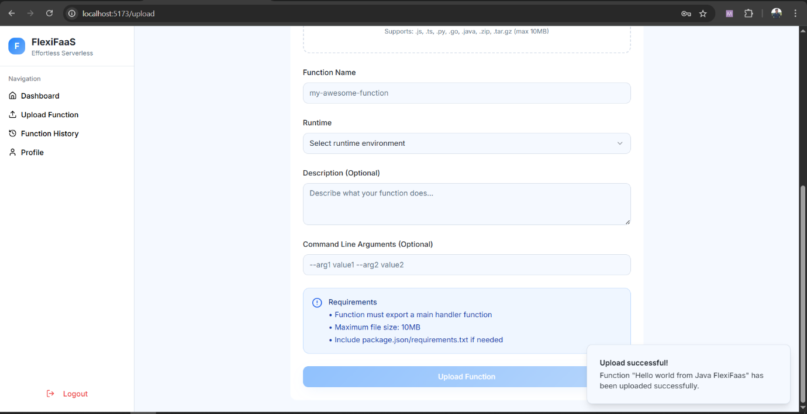

- Function Execution
  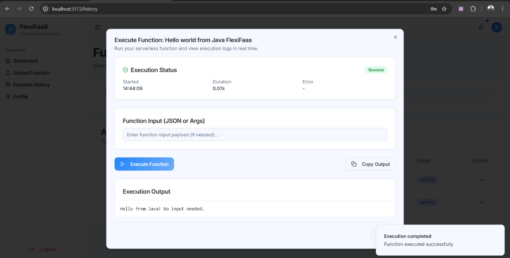
- Function History
  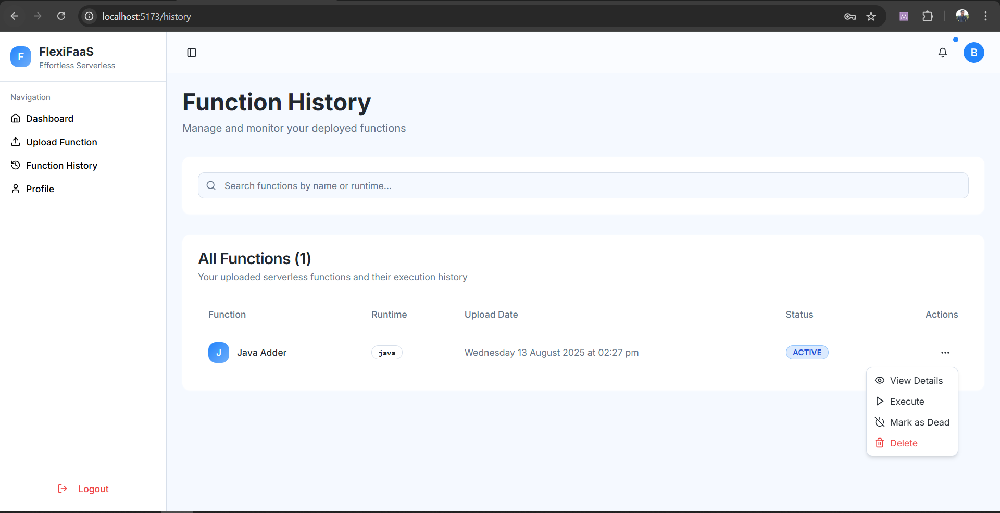
- Execution Logs
  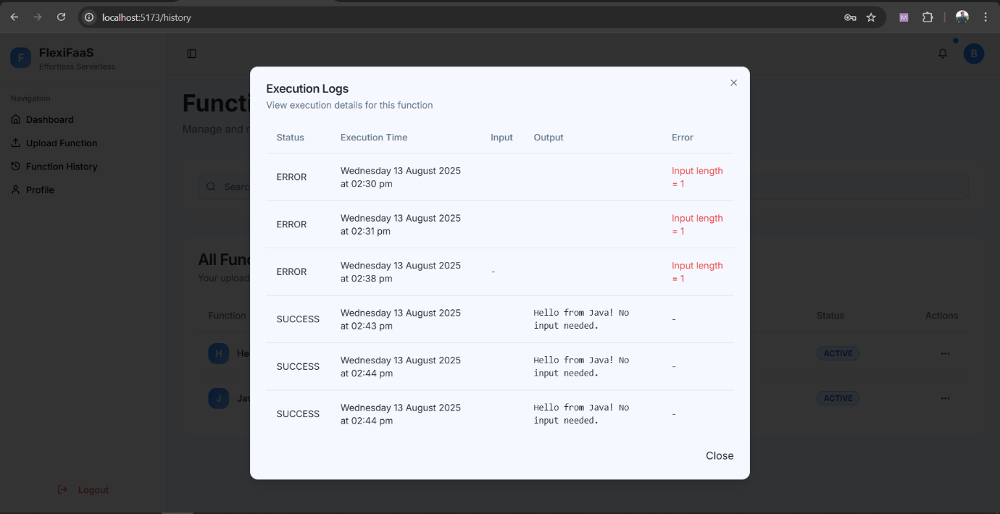

- Function Active or Dead
  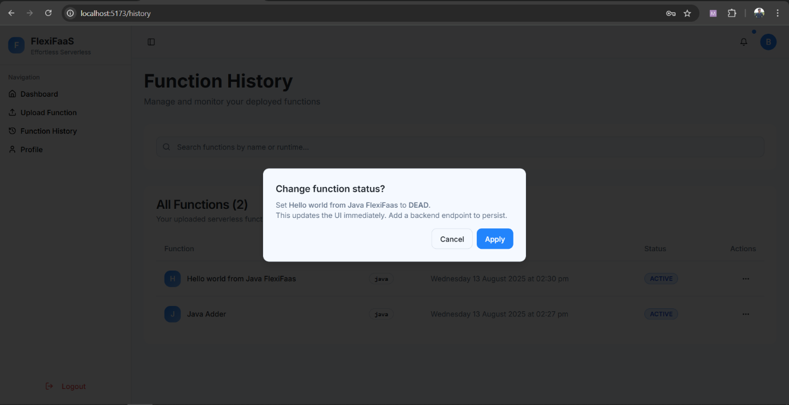

- Admin Dashboard
  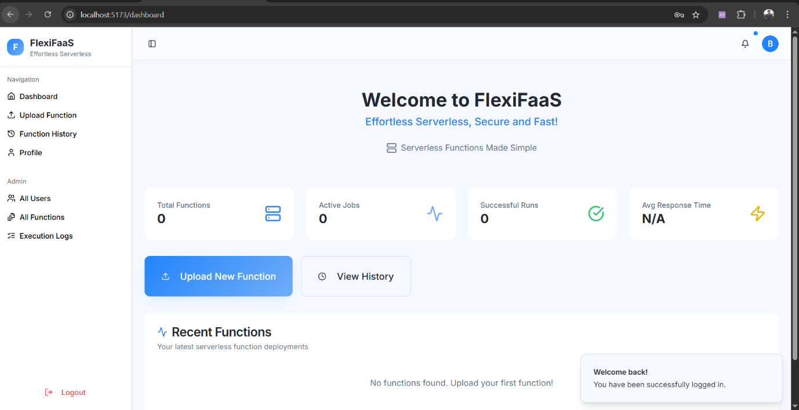
  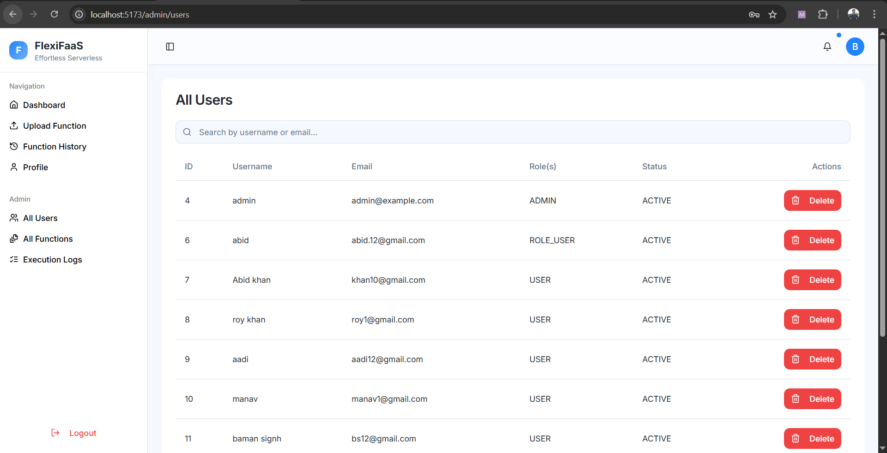

---

## Tech Stack

- **Backend:** Java 17, Spring Boot, Hibernate/JPA
- **Middleware:** Spring Boot (JWT, AES, Security)
- **Frontend:** ReactJS, Axios, Bootstrap
- **Database:** MySQL 8
- **Messaging:** RabbitMQ
- **Testing:** Postman, Swagger

---

## Project Structure

```
| - /backend
| - /middleware
| - /frontend
| - /docs
```

---

## Testing

- API Testing via Postman
- Unit & Integration tests in Spring Boot
- Functional testing of workflows

---

## Future Enhancements

- Support for more languages (Go, Ruby, PHP, C#)
- Containerized & sandboxed execution
- Cloud deployment (AWS, Azure, GCP)
- Real-time monitoring & analytics

---
