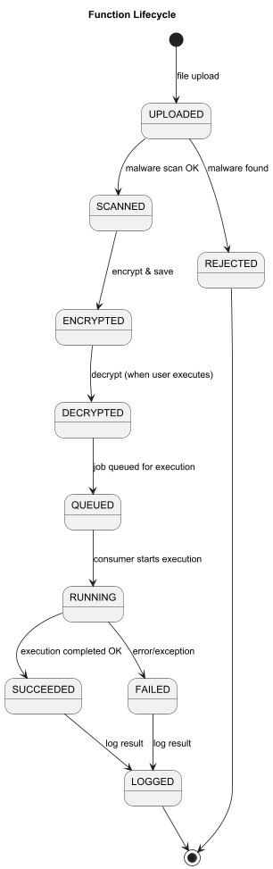
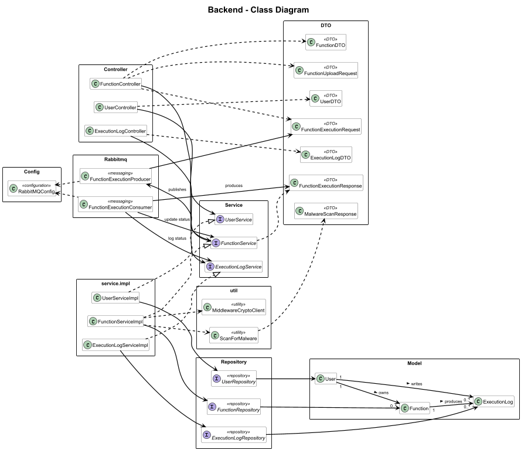

# FlexiFaaS Backend Service


The backend is the **execution engine** of FlexiFaaS. It manages function metadata, interacts with the database, and executes uploaded functions asynchronously via RabbitMQ.

---

## 📑 Table of Contents

- [Responsibilities](#️-responsibilities)
- [Function Lifecycle](#-function-lifecycle)
- [Backend Class Diagram](#-backend-class-diagram)
- [Project Structure](#-structure)
- [Tech Stack](#-tech)

---

## 🛠️ Responsibilities

- User, Function, and ExecutionLog entity management
- CRUD APIs for functions and logs
- File upload & storage (linked with middleware security)
- Multi-language execution (Java, Python, JavaScript) using `ProcessBuilder`
- Async execution with RabbitMQ

---

## 🔄 Function Lifecycle



1. Function uploaded (file/code)
2. Metadata stored in MySQL
3. Middleware encrypts & validates
4. Execution request enqueued in RabbitMQ
5. Consumer executes function → Logs generated
6. Results returned to user

---

## 🏗️ Backend Class Diagram



- Spring Boot app running on **port 8080**
- Connected to **MySQL** & **RabbitMQ**
- Communicates securely with Middleware Service

---

## 📂 Structure

```
| - /entity
| - /repository
| - /service
| - /controller
| - /dto
| - /config
```

---

## ⚙️ Tech

- Java 17
- Spring Boot 3.x
- Hibernate/JPA
- RabbitMQ
- Swagger for API docs

---
