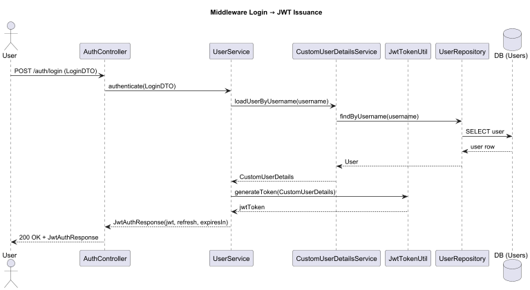

# FlexiFaaS Middleware Service


The middleware is a standalone Spring Boot service that ensures **security and preprocessing** of execution requests before they reach the backend.

---

## 📑 Table of Contents

- [Responsibilities](#-responsibilities)
- [Workflows](#-workflows)
- [Middleware Class Diagram](#️-middleware-class-diagram)
- [Project Structure](#-structure)
- [Tech Stack](#-tech)

---

## 🔐 Responsibilities

- JWT-based authentication
- Role-based authorization
- AES encryption/decryption of uploaded functions
- Malware scanning of uploaded code
- Acts as a **gateway** between frontend and backend

---

## 🔄 Workflows

- JWT workflow

  

- Encrption/Decryption

  

- Malware Scan

  

1. User request hits middleware
2. JWT validated → Role checked
3. File is scanned for malware
4. File is encrypted and stored securely
5. Request forwarded to backend for execution

---

## 🏗️ Middleware Class Diagram


- Runs as Spring Boot app on **port 8081**
- Intercepts all API requests
- Issues & validates JWT tokens
- Passes secure requests to backend

---

## 📂 Structure

```
| - /controller
| - /service
| - /repository
| - /security
| - /dto
| - /config

```

---

## ⚙️ Tech

- Java 17
- Spring Boot Security
- JWT (stateless sessioning)
- AES Encryption Utilities
- Malware Scan Simulation

---
